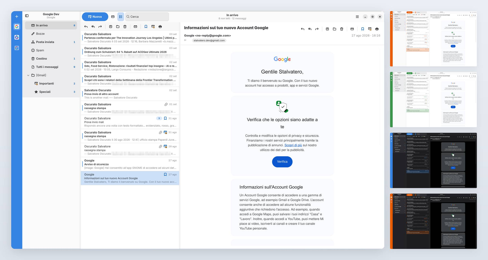

# Letter

Letter is a GTK 4 and libadwaita email client for the GNOME desktop. It sits next to Calendar and Contacts and uses the same identities: **GNOME Online Accounts** for login, **Evolution Data Server** and Camel for mail.



The window title is **Letter**. This is not a GNOME Core application.

I created this application because I love the minimalist, clean, and professional interface of GNOME since version 50, but I couldn't find an email client that lived up to my expectations... until now!

Before you ask, I’m not a professional programmer. I work in a completely different field, but I have a real passion for development and the Linux world in general. I spent months building "Letter" and using it daily before sharing it with the public, and I relied heavily on AI for assistance. So, feel free to try it out and enjoy the app's potential... or not.

**0.9.0-beta.1** is the first public beta. It is already meant for daily use, since I myself am the primary daily user: reading, composing, search, notifications and a lot of optimizations are in place. Account setup still happens only in GNOME Settings → Online Accounts. There is no in-app IMAP wizard and no mailbox that exists only inside Letter. It is non needed!

### Available language

- English
- Italian
- More will come, if you give me a hand.


## What the current version does:


### Accounts and desktop integration

- Discovers Google, Microsoft 365, Exchange, IMAP/SMTP from GNOME Online Accounts and Evolution Data Server
- No second account wizard and no local unnecessary “On this computer” mailbox
- First-run welcome that explains the design and the Online Accounts requirement
- Account rail with provider icons and fast switch between the enabled email accounts
- Per-account HTML multi-signatures, with a starred default for new messages


### Reading

- Adaptive three-pane shell (accounts and folders, message list, reader)
- Conversation grouping, unread filter, bookmarks (compatible with flagged Outlook emails or starred Gmail emails)
- Customizable reading pane on the right, below the list, or hidden
- HTML bodies in WebKit; zoom shortcuts (Ctrl+, Ctrl-, Ctrl0 and Ctrl+mousewheel) enabled and applies to the message body only
- Remote images only from senders you trust (Microsoft 365 also trusts your organisation and address book)
- Attachments, with quick preview through GNOME Sushi when it is installed
- Calendar invitations in the reading pane, with Accept and Reject options
- Print allowed, and “View image” from the message context menu on inline image
- Customizable mark as read on selection, after a delay, or never


### Search

- Search as you type in the current folder
- Operator localized chips: `from:`, `to:` `cc:`, and **contains:** as the default when you press Enter


### Composing

- New message, reply, reply all, forward, and **send again**
- HTML editor with a compact format toolbar
- Automatic links for email addresses and URLs; remove a link from the context menu
- Hunspell spell checking, including “Add to Dictionary” (may require additional package of your choice if not installed)
- Insert image inline, resize from the editor. You can also insert image by drag-and-drop from your PC
- Address book picker from Online Accounts and recent recipients, drag recipient pills
- When you reply and add a new recipient, Letter can offer to attach files from the original message


### Keyboard

Keyboard shortcuts can be viewed by pressing F1 or via the Letter main menu.

### Notifications and preferences

- Desktop notifications for new mail, with archive and delete actions
- Optional notification sound
- Light, dark, or follow the system colour and accent.
- Sync interval and how many days of bodies to keep locally
- Preferences page for recommended packages and how to install them


## What it needs

Letter is built for the **GNOME desktop**. A normal GNOME 50 install already has the libraries the binary links against. See **Where it runs** below.

You must add at least one email account in **Settings → Online Accounts**. IMAP/SMTP are added there too, not inside Letter application. Without Online Accounts, there is nothing to show.


| Package                                   | Role                                                                    |
| ----------------------------------------- | ----------------------------------------------------------------------- |
| `evolution-ews`                           | Microsoft 365 (Graph) mail, calendar, and contacts                      |
| Hunspell + a dictionary for your language | Spell checking while composing                                          |
| Sushi                                     | Quick attachment preview; otherwise Letter opens the default viewer app |


If you use a Microsoft 365 or Exchange account, you need evolution-ews package. To install it use one of the following command according to your distribution package manager:

```
Arch Linux
sudo pacman -S evolution-ews

Debian / Ubuntu
sudo apt install evolution-ews

Fedora
sudo dnf install evolution-ews
```

`evolution-ews` currently depends on the Evolution *package* because a plugin links Evolution’s UI libraries. You do not need to *run* Evolution aaplication and just right now there is no way to safely uninstall Evolution itself.  Leave it closed so only Letter downloads messages. You can hide Evolution app from app drawer by overriding .desktop file. If you have standard repository app, you can use this command in your terminal:

```sh
mkdir -p ~/.local/share/applications && cp /usr/share/applications/org.gnome.Evolution.desktop ~/.local/share/applications/ && echo "NoDisplay=true" >> ~/.local/share/applications/org.gnome.Evolution.desktop

update-desktop-database ~/.local/share/applications
```

Tip: Use the **Microsoft 365** (Graph) account type, not classic Exchange Web Services. Microsoft starts blocking EWS on Exchange Online on 1 October 2026.

## Install

There is no distribution package yet. For this beta, the easiest path is the install script in the repo (`scripts/install.sh`): it clones the source if needed, installs the build packages for Arch, Fedora, Debian/Ubuntu, or openSUSE, compiles Letter, and installs it to `/usr/local`.

> **Note — this installs from source.** The first run may download compilers and development packages (`-devel` / `-dev` headers and related tools), depending on what your distribution already has. That is normal for any build-from-source path, and it can look heavier than installing a ready-made app. The script checks what is missing and installs only what Letter needs from your distribution’s **official repositories** (via `pacman`, `dnf`, `apt`, or `zypper`). When a Flatpak or distro package is available, that will be the lighter option for everyday users.

Derivatives of those families (Mint, Pop!_OS, EndeavourOS, and similar) are covered by the same package managers. On openSUSE, prefer **Tumbleweed** or a recent Leap with current GNOME; older Leap releases may be below Letter’s GTK / libadwaita floor.

For easy installation and testing, use those commands in your terminal:

```sh
git clone https://github.com/stalvatero/letter.git # clone the repo and all you need
cd letter # enter in the downloaded path
chmod +x scripts/install.sh # give execute permissions
./scripts/install.sh # compile and install as normal app
```

The script asks for administrator rights (`sudo`) for packages and for `meson install`. After it finishes, open **Letter** from the app grid. Add at least one account in **Settings → Online Accounts**, then start Letter again.

## Update

To update this build, from the same source tree run (example ~/letter):

```sh
git pull #refresh local tree
./scripts/install.sh # compile the updates and install as normal app
```


## Uninstall

To remove this build, from the same source tree run:

```sh
chmod +x scripts/uninstall.sh
./scripts/uninstall.sh
```

That uninstalls Letter from `/usr/local` and deletes the source tree (including a clone left under `~/.cache/letter/src` when the install script downloaded it). Add `--purge-data` if you also want to delete the local mail cache under `~/.local/share/letter` and `~/.cache/letter`. Online Accounts stay in GNOME Settings.

Flatpak and native packages will come later.

## Build from source

Use this if you prefer to compile by hand. A public beta build:

```sh
git clone https://github.com/stalvatero/letter.git # clone the repo and all you need
cd letter # enter in the downloaded path
meson setup _build --prefix=/usr/local -Dprofile=default
meson compile -C _build
sudo meson install -C _build
```

The Meson `development` profile is only for local work (`meson devenv`). It uses a different application ID and the libadwaita development stripe.

## Contributing

Letter is a personal project. I welcome **bug reports, feature requests, and feedback** through [GitHub Issues](https://github.com/stalvatero/letter/issues). I do not accept pull requests at this time — I prefer to keep the codebase under my direct control while the project is young.

## Where it runs

Letter is a GNOME application. I design it, test it, and use it every day on my Arch Linux and **GNOME 50**. That is the supported environment for this beta.

It needs a recent GNOME platform, not “any desktop that happens to have GTK”. GTK 4 has existed since GNOME 40, but Letter also needs current libadwaita, GNOME Online Accounts, and Evolution Data Server. **GNOME 40 or 41 will not work.** The realistic floor is a current GNOME (about 49 or 50 and newer). I do not test older releases and I will not try to keep them working.

**KDE Plasma, Hyprland, and other desktops** are the same story: the window might compile if you install the GNOME libraries it links against, plus Online Accounts and Evolution Data Server, and if those services actually run. I do not use those desktops, I do not provide a how-to, and I will not treat breakage there as a Letter bug. You are free to try. If you get it running, enjoy it — you are on your own.

Without GNOME Online Accounts there is nothing to show. That is by design, on any desktop.

## Tested on

- Arch Linux
- Fedora Workstation 44
- Ubuntu 26.04.1 LTS
- openSUSE Tumbleweed

## Support

If Letter is useful to you and you would like to support its development, you can contribute via [GitHub Sponsors](https://github.com/sponsors/stalvatero) or [PayPal](https://paypal.me/soscurato). Thank you.

Se Letter ti è utile e vuoi sostenerne lo sviluppo, puoi contribuire con [GitHub Sponsors](https://github.com/sponsors/stalvatero) o [PayPal](https://paypal.me/soscurato). Grazie.

## License

[GPL-3.0-or-later](COPYING)
